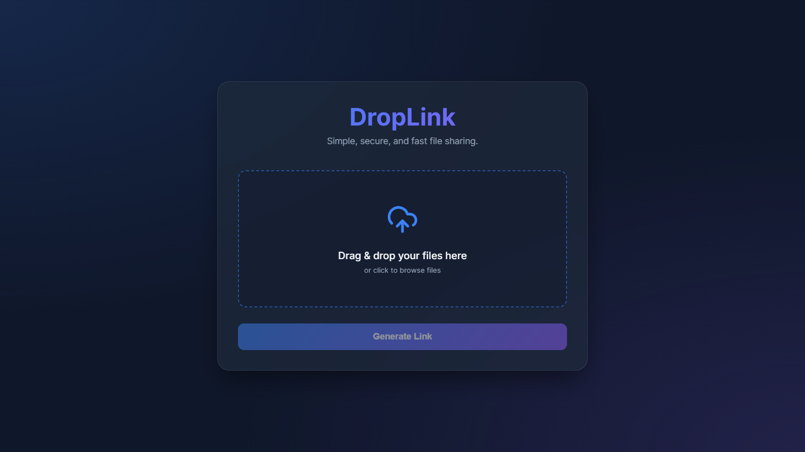
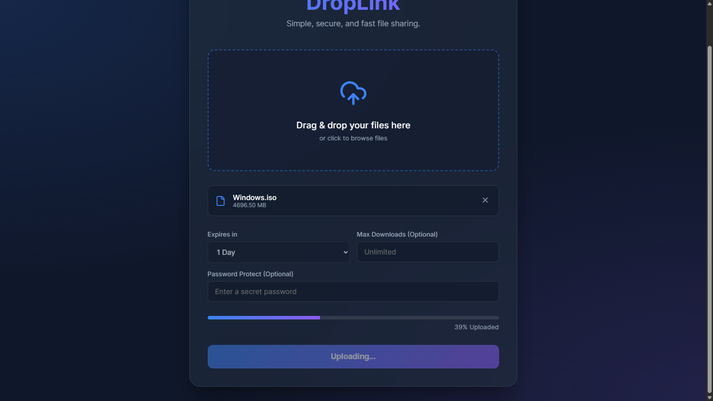
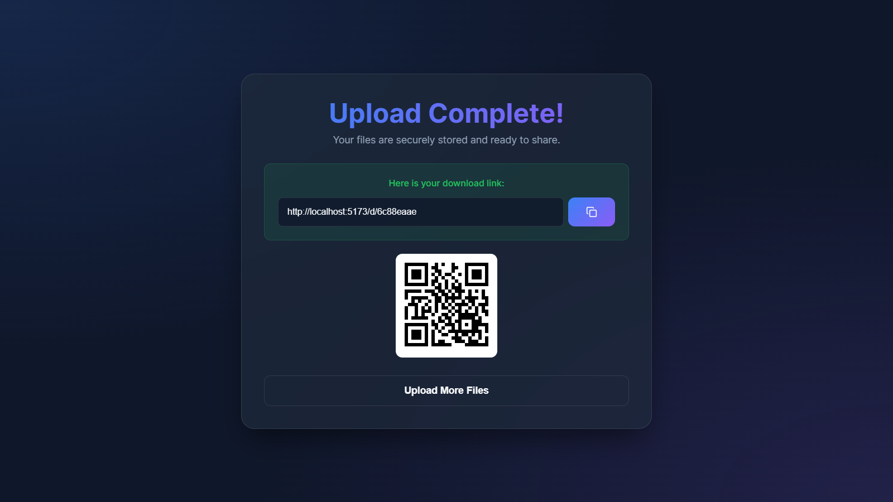
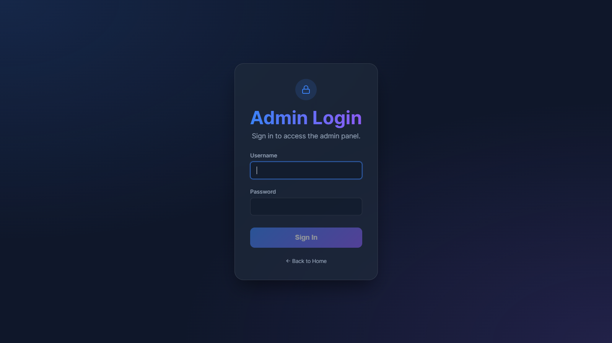
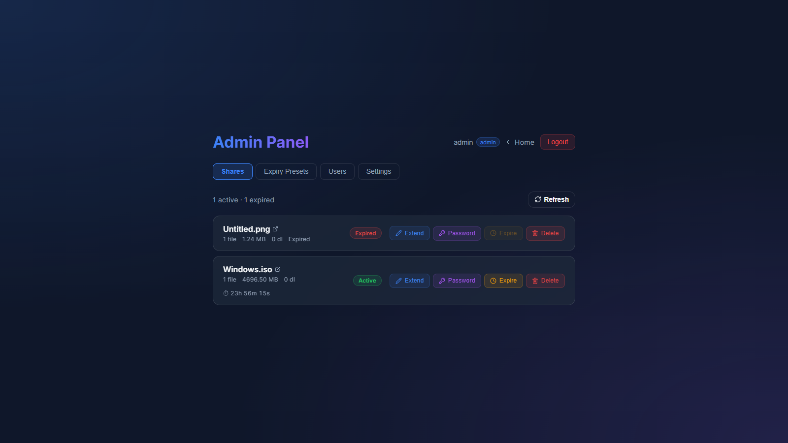
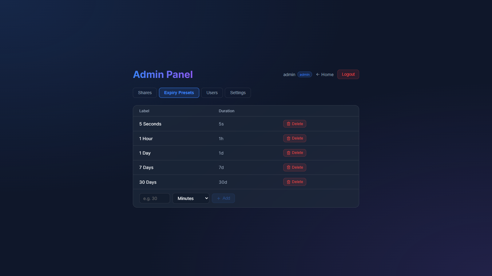
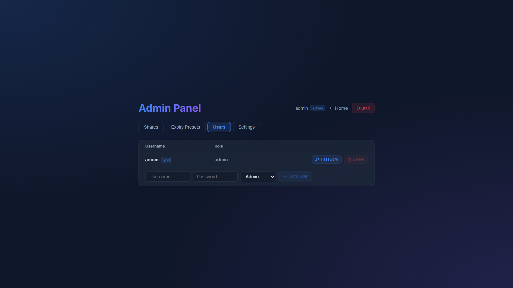
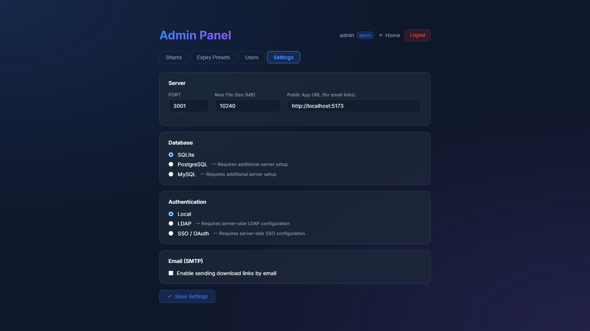

# DropLink

**DropLink** is a modern, lightweight file sharing service (similar to WeTransfer or file.io). Upload files, get a short link or QR code, share — no account required for senders or recipients. Ships with a protected admin panel for managing shares, users, and server configuration.

---

## Screenshots

### Upload

| Drop your files | Uploading | Done — link + QR |
| --- | --- | --- |
|  |  |  |

### Admin panel

| Login | Shares | Expiry Presets |
| --- | --- | --- |
|  |  |  |

| Users | Settings |
| --- | --- |
|  |  |

---

## Features

### Sharing
- **Glassmorphism UI** with Framer Motion animations.
- **Drag & drop** upload, single or multiple files.
- **Auto-ZIP** when uploading more than one file.
- **Expiry presets** — fully configurable from the admin panel (seconds, minutes, hours, or days).
- **Download limits** — auto-invalidate after N downloads.
- **Password protection** via `scrypt` with random salt + timing-safe comparison.
- **Per-file size limit** enforced server-side.
- **QR code** generated for each share.
- **Auto cleanup** on startup and hourly — expired files and DB rows removed.

### Admin panel
- **JWT-based login** at `/admin/login`. Default credentials are seeded on first run from `ADMIN_USER` / `ADMIN_PASS` (see `.env`).
- **Shares tab** — live countdown per share, adjust expiry (± any preset), force-expire, delete.
- **Expiry Presets tab** — add/delete presets; changes show up instantly in the upload dropdown and the extend panel.
- **Users tab** — add users with `admin` or `viewer` role, change passwords, delete. Viewers get a read-only panel.
- **Settings tab** — edit server config (PORT, max file size), pick database backend, pick auth method (local / LDAP / SSO).

---

## Tech Stack

**Frontend**
- React 19 + Vite
- React Router, Axios, Framer Motion
- React Dropzone, Lucide React, qrcode.react

**Backend**
- Node.js + Express 5
- SQLite (embedded, zero config)
- Multer (uploads with size limits)
- Archiver (on-the-fly ZIP)
- jsonwebtoken (admin auth)

---

## Getting Started

Requires **Node.js**.

### 1. Backend

```bash
cd backend
cp .env.example .env    # edit JWT_SECRET and ADMIN_PASS before exposing this
npm install
npm start
```

Runs on **port 3001**. SQLite file and `uploads/` directory are created on first start. The first run also seeds a default admin user from `ADMIN_USER` / `ADMIN_PASS` and prints those to the console.

### 2. Frontend

```bash
cd frontend
npm install
npm run dev
```

`frontend/.env` is already committed (public config only):

```env
VITE_API_URL=http://localhost:3001
VITE_APP_URL=http://localhost:5173
```

Open **http://localhost:5173** — public upload UI.
Open **http://localhost:5173/admin** — redirects to `/admin/login`.

---

## Configuration

`backend/.env` keys:

| Key | Purpose | Default |
| --- | --- | --- |
| `PORT` | Backend HTTP port | `3001` |
| `MAX_FILE_SIZE_MB` | Per-file upload limit | `512` |
| `JWT_SECRET` | HMAC key for admin tokens | `change-me-in-production` |
| `ADMIN_USER` / `ADMIN_PASS` | First-run default admin | `admin` / `admin` |
| `DB_TYPE` | Database backend | `sqlite` (only implemented option) |
| `AUTH_METHOD` | Admin auth method | `local` (only implemented option) |
| `LDAP_*` / `SSO_*` | Placeholders for LDAP / OAuth — not yet wired up | empty |

Most settings can also be edited live from the Settings tab (writes back to `.env`). Restart the backend to pick up `PORT`, `MAX_FILE_SIZE_MB`, or `JWT_SECRET` changes.

### Roles

- `admin` — full access to all tabs and all write operations.
- `viewer` — read-only: can see shares, users, presets, and settings but every write endpoint returns 403 and the UI hides write controls.

---

## Project Structure

```
sharing/
├── docs/
│   └── screenshots/        # images used in the README
├── backend/
│   ├── .env.example        # template — copy to .env and edit secrets
│   ├── database.js         # SQLite schema, migrations, seed defaults
│   ├── server.js           # Routes, auth, uploads, cleanup
│   └── uploads/            # (auto-created) stored files
└── frontend/
    ├── .env                # public API/app URLs
    └── src/
        ├── App.jsx         # Routes + PrivateRoute
        ├── utils/
        │   ├── auth.js     # Token storage + axios interceptors
        │   └── format.js   # Shared formatting helpers
        └── pages/
            ├── Home.jsx        # Upload UI
            ├── Download.jsx    # Public download page
            ├── Login.jsx       # Admin login
            ├── Admin.jsx       # Admin shell with tab nav
            └── admin/
                ├── SharesTab.jsx
                ├── ExpiryTab.jsx
                ├── UsersTab.jsx
                └── SettingsTab.jsx
```

---

## Security Notes

- The repo tracks `.env.example`, not `.env`. Do not commit real secrets.
- Rotate `JWT_SECRET` before any production use — all existing tokens become invalid on change (that's by design).
- The default `admin / admin` credentials exist only so the first login works. Change the password or create a new admin and delete the default via the Users tab.
